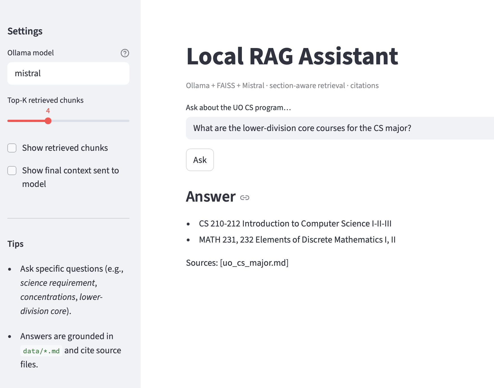

# Local RAG Assistant (Demo)

Minimal, fully-local **RAG** demo that answers questions about the University of Oregon(UO) Computer Science program using local markdown docs.  
Built to show end-to-end understanding of the RAG pipeline.



Main UI: question input, generated answer, and source citation.

Example query:
> What are the lower-division core courses for the CS major?

---


Debug view: retrieved chunks and similarity scores for inspecting retrieval behavior.

## TL;DR
- Fully local RAG system (Ollama + FAISS + Mistral)
- Answers questions over real documents (UO CS pages)
- Section-aware retrieval + source citation

## Why this exists
A small-scale solo project to turn theoretical knowledge into a tangible result:  
**documents → embeddings → vector search → grounded LLM answer with citations**.

## Stack
- **Embeddings:** Ollama `nomic-embed-text`  
- **Vector DB:** FAISS (cosine, with simple MMR)  
- **LLM:** Ollama `mistral`  
- **Data:** `data/*.md` (UO CS pages, section-aware chunking)  
- **UI:** Streamlit (`app.py`) for quick local testing

## Setup
### 1) Install Ollama
This project requires **Ollama** to be installed separately from the Python packages.

- Install from [ollama.com](https://ollama.com)
- Make sure Ollama is running locally before querying the app

### 2) Python environment
```bash
python3 -m venv venv && source venv/bin/activate
pip install -r requirements.txt
ollama pull nomic-embed-text
ollama pull mistral
```

## Run (reproducible)
```bash
# 1) Build embeddings (reads data/*.md -> outputs/embedded_output.json)
python scripts/embed_documents.py

# 2) Build FAISS index (outputs/faiss_index.bin)
python scripts/build_faiss.py
```

### CLI mode
```bash
python scripts/query_rag.py
# example prompts:
# - Explain the science requirement for the CS major, including eligible subjects.
# - List all concentrations available for the CS major.
# - What are the lower-division core courses for the CS major?
```

### Streamlit mode
```bash
streamlit run app.py
# Opens a minimal UI in your browser (text box, retrieved chunks, LLM answer)
```


## What it shows
- Local embeddings → FAISS cosine retrieval (+ MMR)  
- Section-aware chunking for better grounding  
- Mistral answers **only from context**, with **file citations**

## Known limitations (v1)
- Answers are limited to the included markdown pages.  
- Some long, multi-part lines (e.g., Biology AND/OR) may be summarized imperfectly.  
- Occasionally a nearby requirement line (e.g., Writing) appears—kept to show raw grounding + citations.

## Next?
- Deterministic list rendering for complex “AND/OR” requirement blocks  
- Expand/clean data sources
